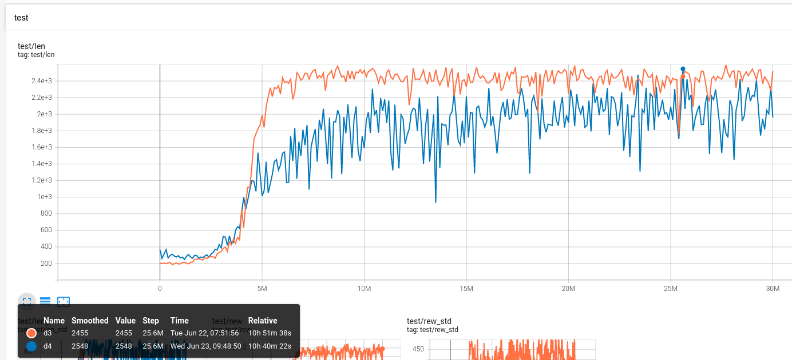
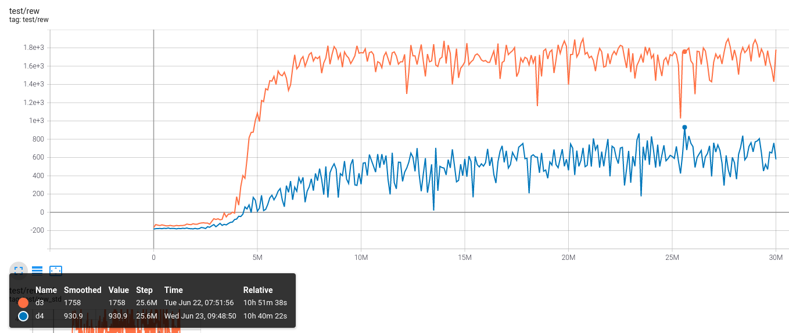

# ViZDoom

[ViZDoom](https://github.com/mwydmuch/ViZDoom) is a popular RL env for a famous first-person shooting game Doom. Here we provide some results and intuitions for this scenario.

## Train

To train an agent:

```bash
python3 vizdoom_c51.py --task {D1_basic|D3_battle|D4_battle2}
```

D1 (health gathering) should finish training (no death) in less than 500k env step (5 epochs);

D3 can reach 1600+ reward (75+ killcount in 5 minutes);

D4 can reach 700+ reward. Here is the result:

(episode length, the maximum length is 2625 because we use frameskip=4, that is 10500/4=2625)



(episode reward)



To evaluate an agent's performance:

```bash
python3 vizdoom_c51.py --test-num 100 --resume-path policy.pth --watch --task {D1_basic|D3_battle|D4_battle2}
```

To save `.lmp` files for recording:

```bash
python3 vizdoom_c51.py --save-lmp --test-num 100 --resume-path policy.pth --watch --task {D1_basic|D3_battle|D4_battle2}
```

it will store `lmp` file in `lmps/` directory. To watch these `lmp` files (for example, d3 lmp):

```bash
python3 replay.py maps/D3_battle.cfg episode_8_25.lmp
```

We provide two lmp files (d3 best and d4 best) under `results/c51`, you can use the following command to enjoy:

```bash
python3 replay.py maps/D3_battle.cfg results/c51/d3.lmp
python3 replay.py maps/D4_battle2.cfg results/c51/d4.lmp
```

## Maps

See [maps/README.md](maps/README.md)

## Algorithms

The setting is exactly the same as Atari. You can definitely try more algorithms listed in Atari example.

## Reward

1. living reward is bad
2. combo-action is really important
3. negative reward for health and ammo2 is really helpful for d3/d4
4. only with positive reward for health is really helpful for d1
5. remove MOVE_BACKWARD may converge faster but the final performance may be lower
